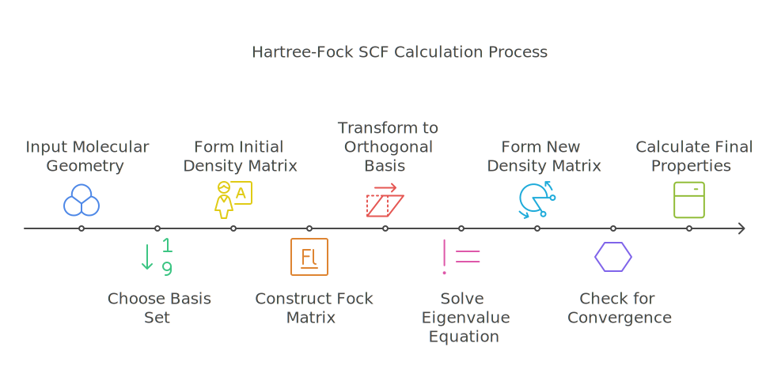
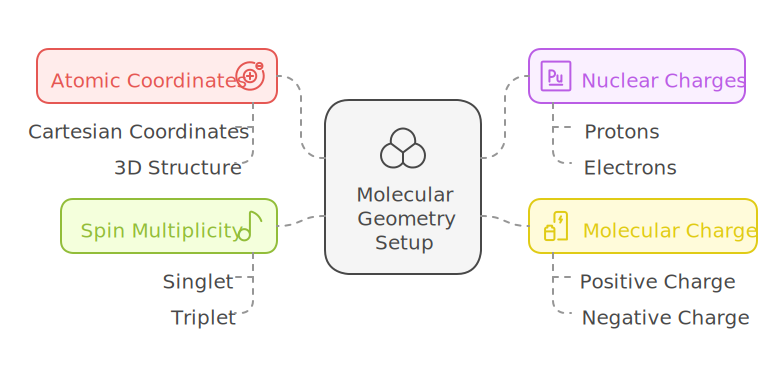
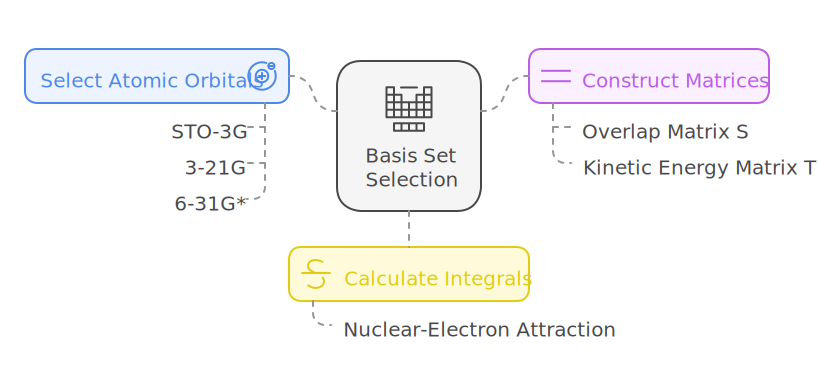
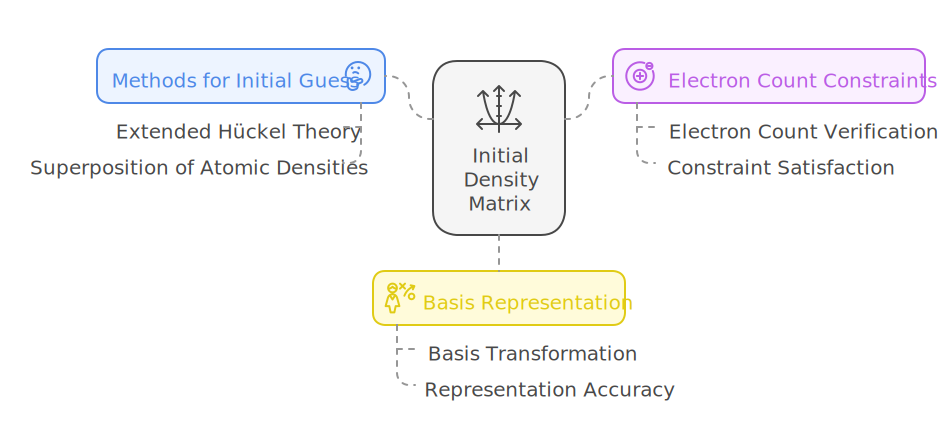
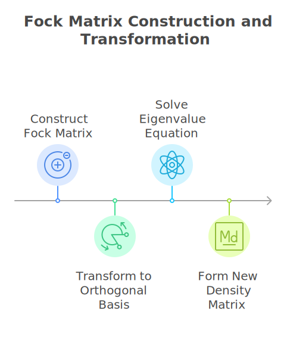
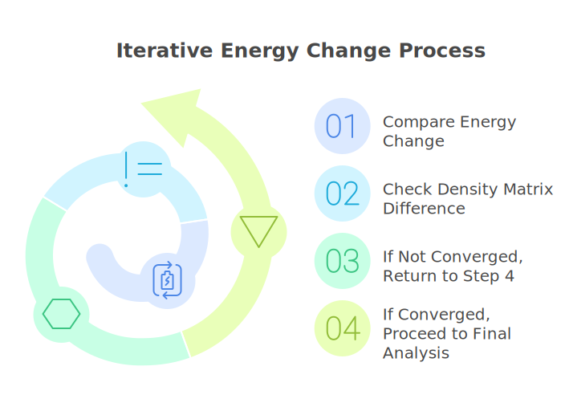
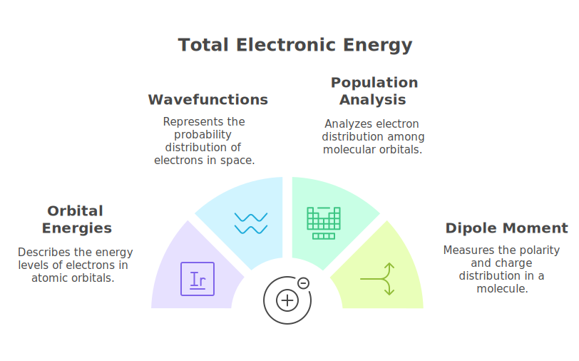

# HowTo perform a Hartree-Fock SCF calculation?

---

---
## 1. Input molecular geometry

- Specify atomic coordinates (usually in Cartesian coordinates)

- Define nuclear charges for each atom

- Set up molecular charge and spin multiplicity

## 2. Choose a basis set

- Select appropriate atomic orbital basis functions (e.g., STO-3G, 3-21G, 6-31G*)

- Construct the overlap matrix S and kinetic energy matrix T

- Calculate nuclear-electron attraction integrals V

## 3. Form initial guess for density matrix P

- Often use extended Hückel theory or superposition of atomic densities

- Ensure the guess satisfies electron count constraints

- Convert density matrix to appropriate basis representation

## 4. Begin SCF iteration procedure:

### a. Construct Fock matrix F

- Calculate one-electron terms (T + V)

- Compute two-electron integrals

- Add Coulomb (J) and exchange (K) contributions

### b. Transform to orthogonal basis

- Solve $$\mathbf{S}\mathbf{X} = \mathbf{X}\mathbf{\lambda}$$ for transformation matrix X

- Form $$\mathbf{F}' = \mathbf{X}^{\dagger}\mathbf{F}\mathbf{X}$$

### c. Solve eigenvalue equation

- Diagonalize F' to get orbital coefficients C' and energies ε

- Transform back: $$\mathbf{C} = \mathbf{X}\mathbf{C}'$$

### d. Form new density matrix

- Populate orbitals according to aufbau principle

- Calculate $$\mathbf{P} = \mathbf{C}\mathbf{n}\mathbf{C}^{\dagger}$$ where n is occupation numbers

## 5. Check for convergence

- Compare energy change between iterations

- Check density matrix difference

- If not converged, return to step 4

- If converged, proceed to final analysis

## 6. Calculate final properties

- Total electronic energy

- Orbital energies and wavefunctions

- Population analysis

- Dipole moment and other molecular properties

